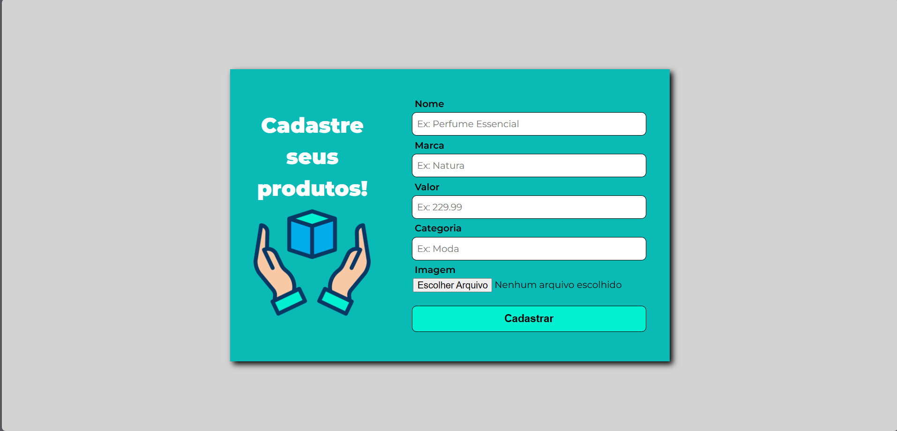

# Initialization
Project started with [Create React App](https://github.com/facebook/create-react-app).

## Scripts
In the project directory, you can run:

### `npm start`

Runs the app in the development mode.\
Open [http://localhost:3000](http://localhost:3000) to view it in the browser.

The page will reload if you make edits.\
You will also see any lint errors in the console.

## Technologies
- React
- Typescript
- Styled-components
- Drona HQ

### Libraries
- Axios
- Styled-componentes

## About
It is a project to improve skills not just in styled-components, but also to improve my skills with React Hooks, doing manipulation with `<form>` data.

Envisiousing performance and code that not repeat yourself.

In the project the user can, register products that will to an fake API, reared in website [Drona HQ](https://apigenerator.dronahq.com/)

Also see the products list of the fake API in route `/products`.

All the `<input/>` need be filled to send the data.

# Preview
